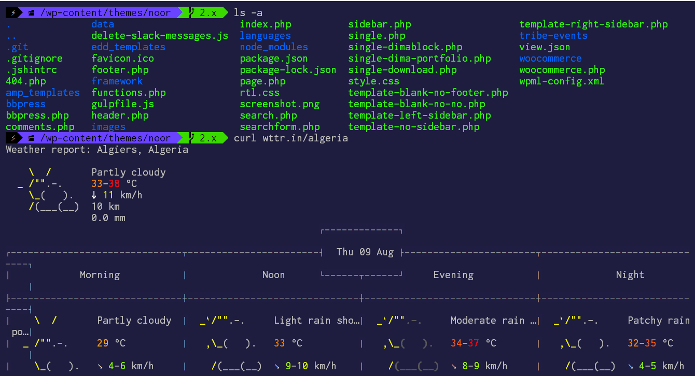

	

<h1 align="center">Shades of Purple Theme for Cygwin</h1>

 

 > Professional Cygwin theme with hand-picked & bold 🦄 shades of purple to go along with your terminal.
 

## Easy Installation

1.  Copy `shades-of-purple.zsh-theme` to `~/cygwin/home/USER/.oh-my-zsh/themes/`
2.  Open `.zshrc` change `ZSH_THEME` to `ZSH_THEME="shades-of-purple"` 

— Done!!! 🙌

 

## Put `Shades of Purple` In Other Places!

I have built other `Shades of Purple` themes for different software. Here's a list.

* 💜 [VSCode theme](https://github.com/ahmadawais/shades-of-purple-vscode) — Shades of Purple
* 💜 [iTerm2 theme](https://github.com/ahmadawais/shades-of-purple-iterm2) — Shades of Purple
* 💜 [Hyper™ theme](https://github.com/ahmadawais/shades-of-purple-hyper) — Shades of Purple
* 💜 [Konsole theme](https://github.com/ahmadawais/shades-of-purple-konsole) — Shades of Purple
* 💜 [Slack theme](https://github.com/ahmadawais/shades-of-purple-slack) — Shades of Purple
* 💜 [Alfred theme](https://github.com/ahmadawais/shades-of-purple-alfred) — Shades of Purple